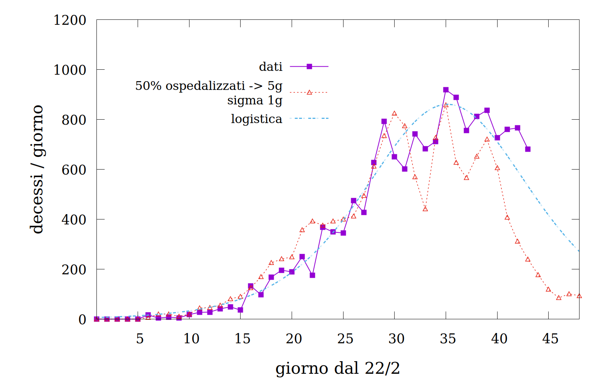
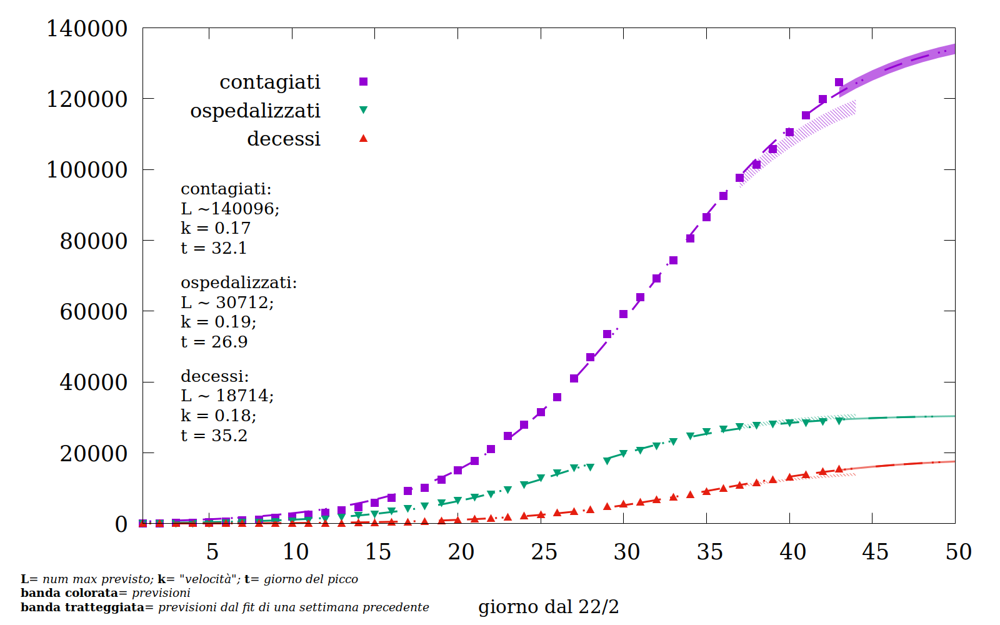
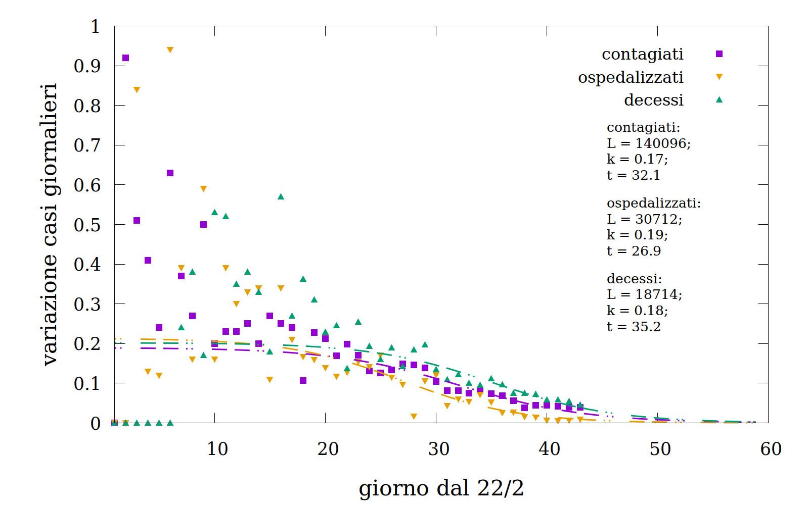
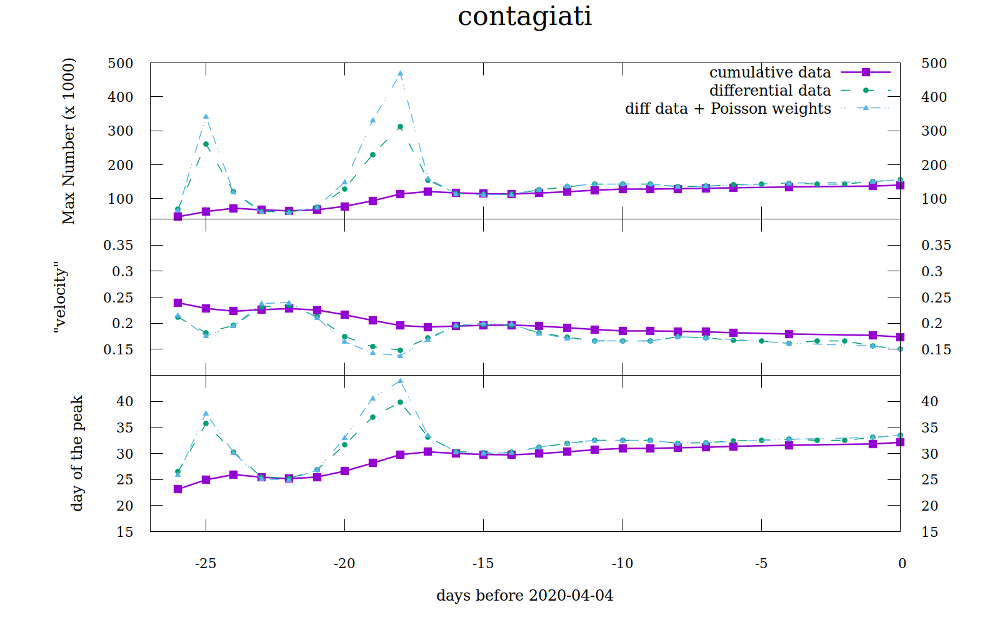
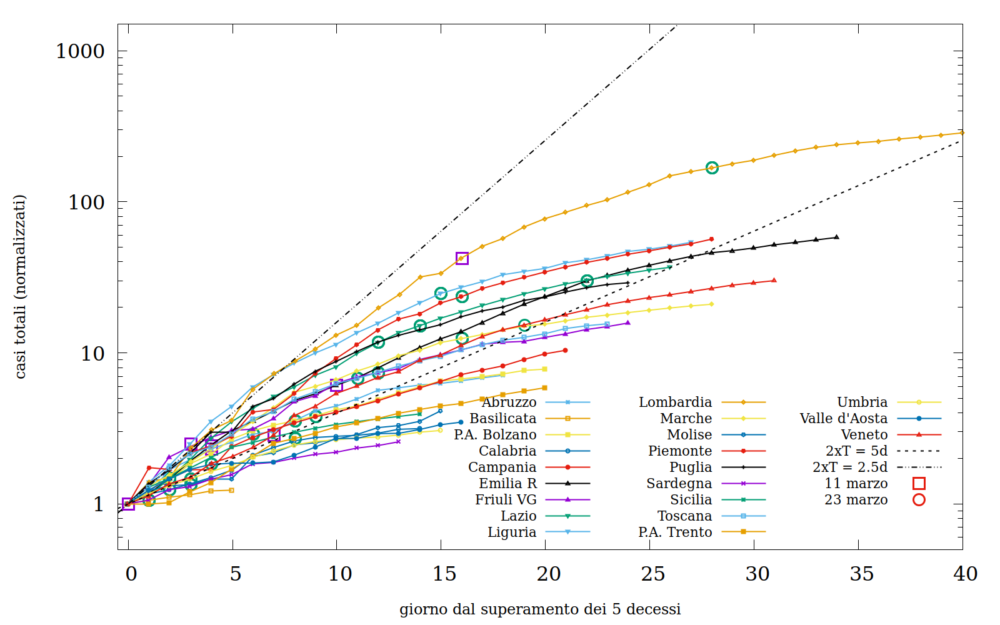
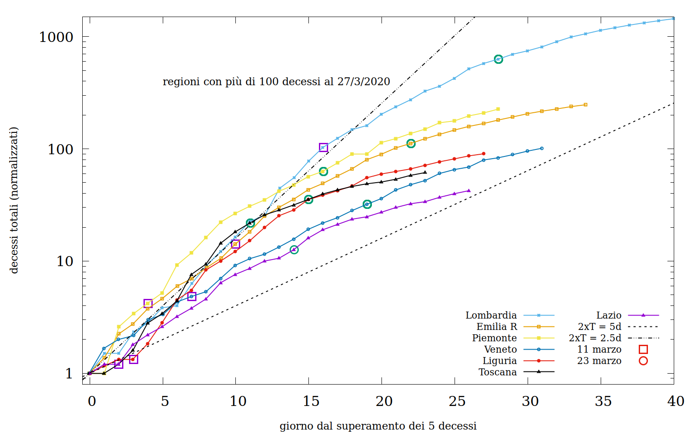
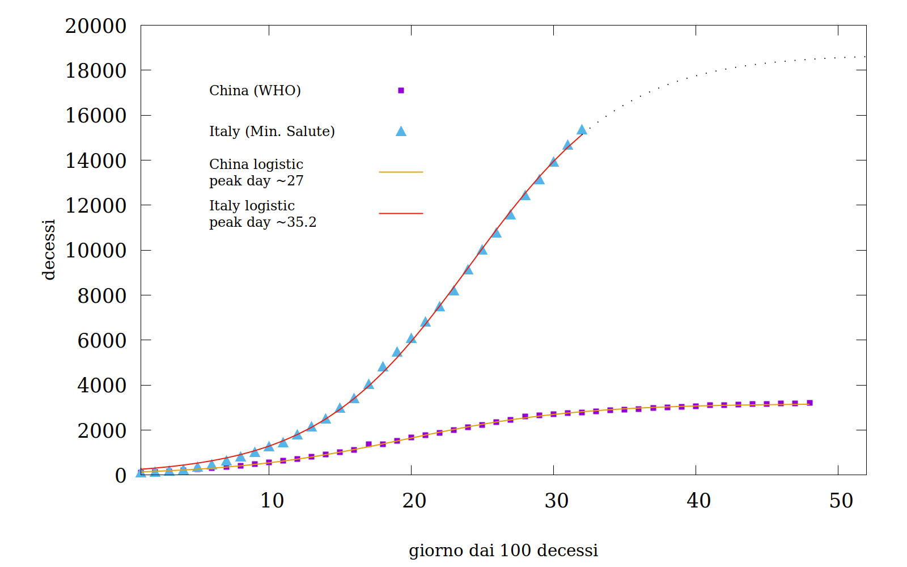

# Qualche considerazione sui dati dell'epidemia di COVID-19 in Italia ( dal 27-3-2020 )

Alla data odierna (27/3/2020) **e solo da qualche giorno, al [contrario delle 3 settimane precedenti](#Perché-NON-usare-una-curva-logistica-in-modo-superficiale),** penso che dai dati si possa essere _cautamente non pessimisti_ e si possano usare i fit delle curve per formulare cautamente delle ipotesi ragionevoli sul futuro. Se non ci sono esplosioni o eventi al momento inaspettati.

In sintesi:

- **Molto probabilmente abbiamo raggiunto "il picco".**  
  [Qui](#Picco-non-picco-e-andamento-della-epidemia) ci sono i grafici e i ragionamenti che suggeriscono questa possibilità come non improbabile.
  Ma è importante capire che non esiste l'Ora X: il "picco" non dura 1 giorno ma si "spalma" su più giorni con fluttuazioni.
  - Per capire cos'è "il picco": [qui](#Quanto-cambia-una-logistica-nel-tempo).
  - Per capire _perché possiamo cautamente dirlo ora_ e perché _molte cose dette con i grafici delle scorse settimane erano sciocche_: [qui](#Perché-NON-usare-una-curva-logistica-in-modo-superficiale)
  - Per capire cos'è una curva logistica e che significato ha: [qui](#Uso-di-una-curva-logistica-come-quando-perché)
  
- **Il fatto che i decessi siano ancora alti NON significa che l'epidemia sta peggiorando.**
  Per quanto il bollettino giornaliero sia mostruoso, doloroso e terrificante, è importante capire che _i decessi ci raccontano cosa è successo 10-15 giorni fa_ e _NON oggi_.
  C'è una relazione che si sta dimostrando abbastanza affidabile tra il numero degli ospedalizzati e l'andamento dei decessi, che riflette un correlazione abbastanza ovvia. L'ISS l'ha formalizzata nei suoi bollettini a partire da ~ 10 giorni fa.
  La mostro [qui](#Andamento-dei-decessi-e-il-death-shift)

- **Stanno funzionando le misure di contenimento? Quanto durerà?**
  _work in progress_, la faccenda è delicata

_Per capire i dati uso una curva logistica; perché e che cos'è è spiegato [qui](#Uso-di-una-curva-logistica-come-quando-perché)_

[_Nota metodologica generale_](#Nota-metodologica).

## Andamento dei decessi e il death-shift 

I [report settimanali](https://www.iss.it/en/rapporti-covid-19) dell'ISS riportano per i casi di decesso un _delay_ di circa 5 giorni fra l'insorgenza di sintomi gravi e il decesso medesimo. È una relazione che funziona piuttosto bene quando si sovrappone ai dati, e ci dice che l'alto numero dei decessi che osserviamo è assolutamente normale ed atteso perché è una conseguenza dell'alto numero di contagi e di persone ospedalizzate nei 10-15 giorni precedenti.

In sostanza, osservando i decessi stiamo guardando nel passato, esattamente come succede in astronomia.

Per sua natura, la curva dei decessi deve vedere il picco in ritardo rispetto sia al picco dei contagiati sia al picco delle ospedalizzazioni (a meno che, naturalmente, non intervengano altri fattori: una cura efficace, ad esempio, o la saturazione del sistema sanitario che non è più in grado di rispondere ai bisogni dei contagiati).

Al momento, i fit che ottengo dalla curva dei decessi danno un picco contemporaneo alla curva dei contagi, che, anche se sarebbe una bellissima notizia, è purtroppo un _nonsense_. 
In supporto al ragonamento sul _delay_ temporale, la figura qui sotto mostra perché probabilmente è un _nonsense_ (ed il perché è collegato al _delay_ cui accennavo all'inizio di questo paragrafo):

In questa figura i quadrati viola sono i decessi riscontrati ed attribuiti al COVID-19, la curva azzurra tratteggiata è la logistica ottenuta dal _fit_ degli stessi dati (all'ultimo giorno).
La curva rossa invece è ottenuta:

- spostando in avanti di 5 giorni il numero di ospedalizzati, e considerandone il 50%

- sommando il numero ottenuto "spalmandolo" su 3 giorni [1](#f1)

  <b id="f1">1</b> tecnicamente, con una gaussiana di sigma 1 giorno, anche se forse sarebbe meglio una log-normal. [↩](#a1)

Non si tratta di un modello, ma solo di un'osservazione. La curva mostrata _non è un fit_, cioè non minimizza gli scarti dai dati osservati, è solo una suggestione.
Tuttavia, è una suggestione che da almeno 3 settimane funziona molto bene (anche se precedentemente usavo 8 giorni e una frazione del 60%), con le ovvie fluttuazioni dovute alla enorme stocasticità dei processi coinvolti (il decorso di una malattia, le cure, eccetera). Più propriamente quella curva andrebbe smussata su intervalli _running_ di più giorni, ma non è questo il senso di questa nota e preferisco si veda così com'è.

**Questa figura ci dice che purtroppo il numero dei decessi rimarrà superiore ai 600 al giorno ancora per 4-5 giorni _almeno_**, perché si tratta della conseguenza di quanto è già avvenuto, ripeto, 10-15 giorni fa. A meno che qualche altro fattore, che non si è mai presentato nelle scorse 3-4 settimane, entri in gioco (e sarebbe naturalmente una meravigliosa notizia).

**Questa curva, tuttavia, pone anche un interrogativo**, poiché di fatto la si ottiene considerando che il 50% degli ospedalizzati di un certo giorno morirà 4-6 giorni dopo. Ora, _se tutti i decessi avvenissero in ospedale_ ci si aspetterebbe che la frazione di ospedalizzati da considerare fosse corrispondente al numero di decessi.
Ad esempio: se la frazione di persone contagiate che richiede cure ospedaliere è del 10-15% e la mortalità sul totale dei contagiati è del 1-3% (questo intervallo di dati sembra essere  il risultato degli studi sulla regione dell'Hubei) e tutti i decessi avvengono in ospedale, allora la frazione di persone ospedalizzate che decedono è compresa **tra il ~6% e il ~30%** nel caso migliore e peggiore rispettivamente.

Il fatto che questa frazione risulti essere il 50% degli ospedalizzati di 5 giorni prima ([una possibilità in comune con UK, secondo NHS](https://www.theguardian.com/society/2020/mar/28/coronavirus-intensive-care-uk-patients-50-per-cent-survival-rate)), o in altri termini il 20% dei contagiati registrati di ~7 giorni prima, significa molto probabilmente che è possibile che  _(i)_ [i contagiati reali siano molti di più dei contagiati registrati](#Forse-i-contagiati-reali-sono-molti-più-dei-contagiati-registrati) e _(ii)_ che forse una frazione sensibile dei decessi avviene al di fuori degli ospedali (la situazione al proposito è molto confusa e drammatica, soprattutto in Lombardia).

## Picco, non picco e andamento della epidemia 

L'andamento del contagio nel suo complesso, ovvero la somma di contagi, ospedalizzazioni e decessi, visto in forma grafica è come segue:

I quadrati viola sono i contagi rilevati, i triangoli verdi sono le persone ospedalizzate e i triangoli rossi sono i decessi. Le linee dello stesso colore che attraversano i punti sono le [curve logistiche](#Uso-di-una-curva-logistica-come-quando-perché) che al momento li descrivono meglio. Le bande colorate alla fine delle curve sono le "previsioni" che quelle curve permettono di fare. Le bande tratteggiate sono le previsioni che _facevano le curve che meglio descrivevano i dati di **7 giorni fa**_.
Le bande racchiudono l'errore previsto entro circa il 67%.
Queste curve sono ottenute dai dati cumulativi, ma [qui](#Perché inizio a fidarmi delle curve) discuto perché, basandomi sui dati differenziali, penso che ci si possa iniziare a fidare.

La figura qui sotto mostra l'**errore** che la curva attuale fa nel descrivere i dati passati. Come si vede gli errori sono inferiori al ~5% o meno da circa 15 giorni.

Questo potrebbe far pensare che il _"fit"_ (ingergo è la curva migliore che descrive i dati) sia molto buono ma non bisogna lasciarsi ingannare da questo: per definizione un fit è la curva che minimizza gli errori.
**[Qua](#Perché-NON-usare-una-curva-logistica-in-modo-superficiale) spiego perché bisogna considerare queste curve - e quelle che si vedono in giro - con cautela**.
È certamente un buon segno che da molti giorni gli errori siano così bassi, ma questo non significa che si possano trarre delle previsioni precise davvero stabili: infatti, come si nota nella prima figura, le previsioni di una settimana fa NON stanno descrivendo molto bene i dati di adesso.
Potrebbe essere che fra un paio di giorni la curva ritorni in quelle previsioni, oppure no: **il punto è che c'è ancora molto rumore stocastico**.
Tuttavia, fino a circa una settimana fa (~22 marzo) il rumore era decisamente maggiore, mentre ora _cautamente_ è possibile dire qualcosa sulla tendenza dell'epidemia senza sbagliare di troppo.

Ovvero, come è anticipato all'inizio di questo testo, **probabilmente siamo nei dintorni del picco dei contagi**.

**Se questo è vero**, ciò significa che:

1. i decessi purtroppo rimarranno alti ancora per ~5 giorni ([qui](#Andamento-dei-decessi-e-il-death-shift) spiego perché)
2. la necessità di nuove ospedalizzazione potrebbe iniziare a diminuire a breve
3. la saturazione della curva dei contagi, cioè il momento in cui NON si avranno nuovi contagi dovrebbe richiedere circa 40 giorni ancora
4. per pensar di essere ragionevolmente fuori dell'epidemia a quel punto bisognerà attendere ancora 2 periodi massimi di incubazione, ovvero $\sim 30\; (2\times 14)$ giorni.

##### Perché inizio a fidarmi delle curve

Penso che si possa cautamente ritenere di essere intorno al picco dei contagi grazie ai due grafici seguenti:

Grafico A:

Questo grafico mostra il comportamento degli indicatori differenziali del fit (in sostanza: della derivata del fit, ovvero degli eventi giornalieri), che sono **molto sensibili** al "rumore" dei dati. Il fatto che stiano lentamente e stabilmente convergendo porta a pensare che l'epidemia è nei dintorni del picco.
Come si nota, fino a ~7-10 giorni fa questo non era vero e infatti le "curve migliori" potevano cambiare molto di giorni in giorno, trasportando in alto o in basso l'umore di chi leggeva improvvide dichiarazioni in vari social-post .

Grafico B:

Il "grafico B" qui sopra mostra l'andamento dei parametri della curva logistica dei contagi nei passati ~20 giorni. Il viola mostra i parametri della curva usata in tutte le figure precedenti, ovvero quella ottenuta dai dati cumulativi.
Le altre due curve, quella verde e quella azzurra, sono relative ai parametri della logistica ottenuta in modo leggermente diverso, cioè considerando il numero di eventi al giorno (per i contagi, le ospedalizzazioni e i decessi; in questo grafico mostro solo quelle per i contagi). La curva azzurra è ottenuta dagli eventi giornalieri ma pesandoli supponendo che siano soggetti a rumore Possoniano (ovvero dando più affidabilità ai giorni con maggior numero di eventi; in sostanza badando meno ai primo ~10 giorni dell'epidemia).
Questo modo di considerare i dati è molto più sensibile al rumore, come si può notare e il fatto che tutti i 3 fit si siano stabilizzati e stiano convergendo contribuisce a farmi ritenere che l'epidemia sia vicina al picco.

(come è spiegato [qui](#Quanto-cambia-una-logistica-nel-tempo) il "picco" è il momento in cui il numero di "eventi" giornaliero è al suo massimo).

Quanto scritto appena qui sopra è vero **se non "esplodono" eventi inattesi**, ovvero se in qualche territorio l'epidemia non va di nuovo fuori controllo o il sistema sanitario cede per lo stress. Tuttavia, guardando i dati delle singole regioni al momento sembra che l'epidemia non dia segni di ripresa in nessun territorio:

nel grafico qui sopra sono mostrati i casi registrati, allineati al giorno del superamento dei 5 decessi e il numero di contagiati registrati è diviso per il numero dei casi a quello stesso giorno. In sostanza, l'altezza della curva dice di quanto i casi rilevati si siano moltiplicati dal giorno del superamento del 5 decesso.
I quadrati viola e i cerchi verdi indicano per ogni curva l'11 Marzo e il 23 Marzo.
L'11 Marzo è il giorno dell'entrata in vigore delle prime misure più restrittive, mentre il 23 Marzo è il giorno dela chiusura di (almeno) alcuni luoghi di lavoro (ricordiamo che tra l'11 e il 23 Marzo milioni di persone hanno continuato ad andare in **moltissimi** luoghi di lavoro non pubblici, anche quelli legati a produzioni non essenziali per continuare a garantire i servizi essenziali ed importanti).

Come si vede, praticamente tutte le regioni stanno abbandonano una crescita esponenziale pura (che sarebbe una linea retta in questo grafico). Le due linee tratteggiate infatti mostrano due esponenziali: quella inferiore un esponenziale con tempo di raddoppiamento di 5 giorni, quella superiore con un tempo di raddoppiamento di 2.5 giorni. Tutte le regioni hanno ormai un tempo di raddoppiamento significativamente maggiore di 5 giorni, e in continua crescita.

Questo grafico mostra le ospedalizzazioni, ma solo nelle regioni "peggiori" (dal punto di vista dei numero di decessi):

e quest'ultimo grafico mostra invece i decessi ([ricordiamo](#Andamento-dei-decessi-e-il-death-shift) che i decessi "guardano" nel passato di ~5 giorni) nelle stesse regioni 

I commenti sono gli stessi che nel caso precedente. Tutte le regioni peggiori mostrano incoraggianti segno di costante miglioramento, e quindi questi ultimi grafici sono rassicuranti sul fatto che non ci saranno altre "esplosioni" inattese

------

------

------

## Forse i contagiati reali sono _molti_ più dei contagiati registrati 

Che i contagiati registrati siano un limite inferiore del numero di contagiati reali è una considerazione del tutto ovvia e, immagino, valida in ogni situazione. 
Quale sia il numero dei contagiati reali è di indubbio interesse per una serie di ovvi motivi: darebbe la misura reale dell'andamento e della diffusione del virus, del rapporto tra [asintomatici](#Quali-dati-usare-e-il-numero-totale-di-contagiati) e sintomatici, del comportamento del sistema sanitario nazionale e, non di minore importanza, del tasso di mortalità.

Capire quale sia questo numero non è una questione semplice e al momento può essere fatto solo in modo approssimato e indiretto. Oltretutto, i dati sono molto incerti, disomogenei fra territori diversi e riflettono anche comportamenti e standard differenti fra i vari sistemi sanitari locali.
**Tuttavia, diverse considerazioni portano a ritenere che il numero dei contagiati reali sia sostanzialmente superiore al numero dei contagiati registrati**.

1. Il numero delle persone che richiedono l'ospedalizzazione in Italia è molto alto.
   Nel mese scorso il [tasso di ospedalizzazione](./plots/tasso_ospedalizzazione.png) è stato fra il 30% e il 50% (media e mediana sui giorni entrambe ~39%) a fronte di un tasso di ospedalizzazione [tipico](https://jamanetwork.com/journals/jama/fullarticle/2762130) del 10-15%.
   Ipotizzando che la popolazione degli ospedalizzati sia completa (ovvero che tutte le persone che necessitavano di cure ospedaliere sono state individuate e che tutte hanno avuto accesso alle cure ), questo potrebbe significare che la popolazione dei contagiati reali è 2.5-4 volte quella dei contagiati rilevati (ovvero alla data del 30/3/2020 tra le **~250mila** e le **~400mila** persone).
   Ciò riporterebbe il tasso di mortalità a circa il $\sim3\%$.
   
2. Il numero delle persone asintomatiche tra i contagiati rilevati è, per i dati disponibili,  stabile intorno al 6% (la figura qui a fianco riporta i dati del rapporto ISS del 30/3/2020).

   Quanto siano in effetti i contagiati asintomatici sul lungo periodo è ancora difficile da stimare a quanto pare:  [il rapporto ECDC](https://www.ecdc.europa.eu/en/publications-data/rapid-risk-assessment-novel-coronavirus-disease-2019-covid-19-pandemic-increased) del 12 marzo 2020 stima che la percentuale di contagiati che rimangono asintomatici sul lungo periodo è molto bassa, anche intorno al ~1-3%.
   Tuttavia, a [quanto pare](#https://www.scienzainrete.it/articolo/facciamo-tutta-italia-come-vo'-e-corea-del-sud/sergio-romagnani/2020-03-16)  il ~%75% dei contagiati di Vo' risultava, almeno sul breve periodo asintomatico. Se prendessimo questo dato come rappresentativo, allora vorrebbe dire che moltissimi asintomatici non sono stati rilevati e potremmo ricavare da ciò una stima della dimensione della popolazione degli asintomatici reali. Quindi, se supponiamo che gli asintomatici siano il ~50-75% dei contagiati, poiché solo il 6% dei contagiati rilevati è asintomatico allora ciò potrebbe significare che i contagiati reali sono ~1.9-3.8 volte i contagiati rilevati, ovvero tra le **~190mila** e le **~380mila** persone (alla data del 30/3/2020).
   
3. Anche la mortalità potrebbe essere usata per riscalare il numero di contagiati rilevati al numero di contagiati reali. Anche questo dato al momento è molto incerto, essendo nell'intervallo ~1-3%, con punte più elevate in alcuni territori. Assumendo ~3%, dovremmo riscalare il numero di contagiati rilevati di circa 3-4 volte.
   Tuttavia, in questo momento la mortalità in Italia sta mostrando un comportamento che non comprendo bene.

## Quali dati usare e il numero totale di contagiati 

Nonostante la maggior parte delle analisi e delle discussioni che ho visto in rete si concentri sull'andamento dei **contagiati registrati**, questo numero non è un ottimo indicatore dell'andamento dell'epidemia, come qualcuno ha già notato pubblicamente (incredibile che non fosse chiaro da subito) .
O meglio, lo sarebbe se si potesse avere sotto scrutinio costante _tutta la popolazione suscettibile_, cosa che ovviamente non è possibile. La Germania, avendo iniziato il *testing* già a Gennaio è riuscita fin'ora ad avere una stima delle persone contagiate molto buona (ed è per questo che il tasso di mortalità in Germania è così basso, oltre a questioni legate ai conteggi: [qui](https://www.theguardian.com/world/2020/mar/22/germany-low-coronavirus-mortality-rate-puzzles-experts) ad esempio c'è una breve ma interessante discussione su questo punto). Può essere tuttavia che con li procedere dell'epidemia anche i conteggi tedeschi divergeranno da una buona stima.
Probabilmente, Il numero dei contagiati registrati rimane comunque un buon *proxy* (cioè un indagatore stabilmente agganciato al numero reale) dei contagiati sintomatici.

Al contrario, gli **ospedalizzati**, ovvero le persone che devono ricorrere a cure ospedaliere, è un ottimo (solo in senso statistico, purtroppo) indicatore di come l'epidemia procede, _se il sistema sanitario è in grado di rispondere ai bisogni di tutti i soggetti in stato di necessità_.
Per questo è necessario supporre che gruppi umani abbastanza grandi grandi rispondano in modo omogeneo al virus; ovvero che i cinesi, gli europei, gli americani, gli africani, ma anche gli italiani, gli spagnoli, i tedeschi, ecc. si ammalano gravemente nella stessa quantità relativa, cioè che una stessa frazione della popolazione incorre in sintomi gravi. Ciò al momento sembra essere verificato, come è lecito aspettarsi, e anche i sintomi per questo virus sono molto ben caratterizzati. 
La frazione di popolazione che ha bisogno di cure ospedaliere oscilla tra il **10%** e il **15%**.

Anche i [**decessi**](#Andamento-dei-decessi-e-il-death-shift), purtroppo, sono un buon numero per capire l'andamento della malattia. Forse si tratta del numero più stabile, perché è il più certo - _sempre se il sistema sanitario non è al collasso e tutte le morti vengono correttamente registrate e addebitate alla malattia_.
Da un punto di vista logico, è lecito aspettarsi che su un numero di malati grande emerga un comportamento coerente del decorso che porta al decesso, ovvero un tempo caratteristico tra l'insorgenza del sintomi e il decesso. Naturalmente, non si tratta di un tempo cronometrico, ma di un percorso che ha una significativa varianza individuale e una dipendenza dalle cure cui i soggetti sono sottoposti.

## Uso di una curva logistica, come quando perché

[Che cos'è una curva logistica](#Che-cos'è-una-curva-logistica)

[Significato dei parametri della curva logistica](#Significato-dei-parametri-della-curva-logistica)

[Quanto cambia una logistica nel tempo: ovvero cos'è il "picco"](#Quanto-cambia-una-logistica-nel-tempo)

[Perché usare una curva logistica](#Perché-usare-una-curva-logistica)

[**Perché NON usare una curva logistica in modo superficiale**](#Perché-NON-usare-una-curva-logistica-in-modo-superficiale)

#### Che cos'è una curva logistica

La curva logistica (una curva che ha una forma di "S" stirata; all'inizio e alla fine è confondibile con un esponenziale) è la curva di sviluppo di un fenomeno intrinsecamente esponenziale in un "mondo finito", ovvero in un ambiente in cui i soggetti suscettibili di partecipare al fenomeno si esauriscono mano a mano che il fenomeno si sviluppa.
Questo accade per la crescita delle popolazioni, per l'utilizzo (predatorio, ovvero a tasso di crescita costante) delle risorse e molti altri fenomeni.
In realtà, vi sono molte curve "a S", più o meno adatte a diversi fenomeni; esiste una formulazione generale da cui si deriva una gran parte di esse.
Io per analizzare i dati sto usando una semplice logistica simmetrica 
$$
S(t) = \frac{L}{1+e^{k\times(x-\tau)}}
$$
Che ha questa forma (la linea viola della figura qui sotto): come si vede, la quantità descritta dalla curva (in questo caso: contagiati, ospedalizzati, guariti, decessi, eccetera) cresce inizialmente in modo _apparentemente_ molto lento, poi "esplode" esponenzialmente in modo che la differenza fra un giorno e il precedente e sempre più grande;  fino a raggiungere un punto (il punto di flesso, il famoso "picco") in cui inverte la tendenza e piano piano raggiunge il suo valore massimo mentre la variazione giornaliera è sempre minore.

La crescita della logistica rispetto al valore è molto grossa: nell'esempio qui sotto, alla fine raggiunge un valore che è pari a 6000 volte quello del giorno 1 (scala $y$ a destra).

#### Significato dei parametri della curva logistica

**x** è il tempo, ovvero il giorno cui si riferiscono i dati, o le previsioni

**L** è il parametro di saturazione, ovvero il massimo valore che la curva raggiungerà (formalmente dopo un tempo infinito, ma in pratica dopo un tempo sufficientemente grande rispetto al parametro $k$; ad esempio, dopo un tempo pari a $2\times k$ (60 giorni nell'esempio sopra) si può assumere che la curva è arrivata a saturazione.

**k** è la "velocità" con cui la curva cresce all'inizio o diminuisce alla fine. Più è piccolo più la curva è "lenta" e più tempo ci vuole per arrivare al valore massimo $L$. In sostanza, più $k$ è piccolo più la "S" è stiracchiata, più è grande e più la "S" è "ripida"

**$\tau$** è il momento in cui la curva cambia curvatura: ovvero quando inizia a flettere e dal regime di crescita passa al regime in cui poi arriverà al valore massimo.

#### Quanto cambia una logistica nel tempo

La variazione della quantità descritta dalla curva (per noi, ad esmepio, i contagiati o gli ospedalizzati) è il numero di eventi che osserviamo giorno per giorno: ovvero quanti contagiati, guariti, ospedalizzati o, purtroppo, decessi si contano in più rispetto al giorno prima.

Nella [figura precedente](#esempio-logistica) la linea azzurra tratteggiata è la variazione della logistica (la linea viola) in ogni punto: dove la curva azzurra è più ripida la logistica varia di più da giorno a giorno, dove è meno ripida o piatta varia meno. **Il punto in cui varia di più è il punto centrale**, che corrisponde al parametro **$\tau$** spiegato più sopra: questo è il punto dove la curva cambia curvatura, e dove la sua variazione è più rapida.
È il famoso e tanto atteso "**picco**" di cui si parla, ovvero il giorno in cui i contagiati del giorno saranno di più ma poi inizieranno a decrescere.
Essendo un processo biologico e sociale che coinvolge corpi reali e dinamiche personali, il "picco" in realtà si spalma su qualche giorno e può avere delle fluttuazioni: possiamo quindi dire di averlo superato solo dopo un po' di tempo, quando i conteggi giornalieri saranno stabilmente e significativamente in decrescita. E, soprattutto, quando gli indicatori _differenziali_ dei fit, che sono molto sensibili al "rumore", saranno stabili.

In realtà, come spiego [qui](#Andamento-dei-decessi), i contagiati sono un conteggio approssimato: è bene incrociare i dati della variazione dei contagiati (cioè quanti nuovi contagiati ogni giorno) con altri due indicatori, ovvero gli ospedalizzati e i decessi.

#### Perché usare una curva logistica

Essenzialmente per 2 motivi.

1. **per ignoranza**: le altre curve usate in epidemiologia hanno più parametri e, sostanzialmente, è più delicato usarle con consapevolezza; ovvero, in questo caso, bisogna essere degli epidemiologi che sanno quello che stanno facendo caso per caso. Io non lo sono, quindi mi limito al caso più semplice e di più facile interpretazione.
2. applicato alla regione dell'Hubei, che sembra essere a saturazione, la curva logistica **funziona piuttosto bene**:
   

Nella figura qui sopra i quadrati viola sono i decessi cumulativi dell'Hubei (fonte: report quotidiano WHO), la linea gialla è la logistica che li interpola. I triangoli azzurri sono i decessi cumulativi dell'Italia (fonte: [dati della protezione civile](https://github.com/pcm-dpc/COVID-19/tree/master/dati-andamento-nazionale)), la linea rossa è la logistica che li interpola e la linea tratteggiata è la continuazione della stessa logistica.
I dati sono allineati al giorno del superamento dei 100 decessi ([perché scelgo i decessi](#Quali-dati-usare)).

#### Perché NON usare una curva logistica in modo superficiale

Il punto è che usare una curva logistica mentre siamo **prima del flesso**, o picco, del fenomeno che osserviamo **per fare delle "previsioni"** è **molto sciocco** _quando siamo di fronte a fenomeni che hanno una inerente natura stocastica_ come, appunto, un'epidemia durante la quale gli eventi non avvengono _singolarmente_ in modo certo.

In sostanza, nessuno può sapere quando un preciso soggetto verrà in contatto con il virus, se si ammalerà, se e quando svilupperà i sintomi e il decorso della malattia. Questo è ovvio per chiunque.
La conseguenza è che "i dati", cioè l'insieme degli eventi singoli che osserviamo, sono soggetti a fluttuazioni, cioè a deviazioni dai valori che sarebbero stati attesi secondo una certa curva.
Quindi, quando si trova la "curva che fitta meglio i dati", ovvero quella che è "meno sbagliata" rispetto alle osservazioni, questa curva è fortemente sensibile alle variazioni stocastiche degli eventi medesimi **e può dare risultati molto diversi nel giro di pochi giorni**.

**Il "rumore" degli eventi è MOLTO più grande prima del flesso** e si riduce moltissimo dopo il flesso. Ecco perché è molto sciocco e fuorviante affannarsi a fare previsioni, altalenando tra euforia e disperazioni in balia delle fluttuazioni da un giorno all'altro.
L'uso corretto dei fit in quella fase è una _cauta_ rilevazioni di tendenze e, soprattutto, il monitoraggio della distanza dal picco che è tanto maggiore quanto maggiore è la varianza dei parametri della curva che fitta i dati.

Per avere un esempio di come funziona, nella figura qui sotto ho "costruito" 3 popolazioni di dati che seguono di base una logistica ma sui quali ho aggiunto un segnale di rumore Possoniano, ovvero simile a quello atteso in un processo epidemico:

Nella figura mostro il rapporto tra il valore dei dati e il valore "vero" della logistica da cui sono stati costruiti.
La conseguenza, ripero, è che finché siamo prima del flesso i valori del fit della curva che otteniamo sono estremamente "rumorosi", cioè tanto più variabili ed imprecisi quanto più siamo lontani dal flesso.
In questa gif animata, mostro come cambia la curva ottenuta dai fit dei dati giorno per giorno. È ovvio vedere quello che dicevo ora: prima del picco le curve cambiano in modo notevole, mentre a cominciare da pochi giorni prima del picco (giorno 30) si stabilizzano sempre di più.
**A questo punto** possiamo usare la logistica per fare delle previsioni, **se non  incorrono nuovi fenmeni rumorosi** (ad esempio lo svilupparsi di un altro focolaio importante).

La forma della curva è diversa da quella che si vede nella figura precedente perché qui è stata graficata in scala verticale _logaritmica_. È solo un modo diverso di mostrarla per poter vedere nello stesso grafico curve molto diverse fra loro (notate che nella scala verticale i valori variano di 100,000 volte).

## Nota metodologica

Le epidemie sono un fenomeno altamente specifico che va trattato con competenza. Il fatto che spesso non si ha un'unica popolazione con un insorgere coevo dell'epidemia ma alla convoluzione di focolai multipli fra di loro sfasati e fra di loro non omogenei rende l'applicazione di modelli epidemiologici non banale.
In Italia, com'è noto, l'insorgere dell'epidemia si è avuto in tempi molto diversi e le peculiarità e disomogeneità territoriali ne possono determinare un'evoluzione affatto differente.

**I grafici che sono discussi qui NON sono un "modello" dell'epidemia**, che appunto richiederebbe un trattamento singolare di ogni regione, se non di ogni provincia, con delle assunzioni che io non sono in grado di fare.

**Si tratta solo di un tentativo di "monitorare" l'andamento dell'epidemia**, così come ricostruibile dai dati della protezione civile, nazionali e regionali.
Forse **con qualche accuratezza in più** di alcuni altri plot incauti che si sono visti circolare, che, ad esempio, propagavano un continuo e altalenante aggiornamento dell'andamento in una fase in cui contemporaneamente c'era un'ovvia espansione esponenziale e un elevato "rumore Poissoniano" del segnale osservabile.
Fino a circa il ~20-22 Marzo 2020 i _fit_ (cioè le "curve" che meglio descrivono i dati fino ad un certo momento) presentavano una grande variabilità di giorno in giorno: questo era il segnale che il "rumore" - cioè la manifestazione dei processi stocastici tipici dei processi biologici e umani - era ancora troppo grande e, sostanzialmente, si potevano avverare molti scenari differenti. Fare "previsioni" in quel regime, e rimanere appesi alle variazioni giornaliere - di dati oltretutto [non troppo significativi](#Quali-dati-usare) - non ha molto senso: l'unica conclusione sensata era che non c'era ancora una conclusione.
Una discussione più tecnica con qualche dimostrazione di questo fatto è [qui](#Perché-NON-usare-una-curva-logistica-in-modo-superficiale), alla fine dello spiegone sulla curva logistica.

------

------

------

##### Chi sono

Io sono un astrofisico e non un epidemiologo. Queste note sono soltanto un piccolo monitoraggio dei dati, e le varie considerazioni sono molto caute e prudenti proprio perché la materia è _molto_ complessa.
Per fortuna, gli scienziati che lavorano all'ISS hanno ampiamente mostrato di saper fare bene il loro lavoro. In particolare ho molto apprezzato che, in modo assolutamente corretto, non abbiano rilasciato predizioni e speculazioni se non quando fossero solidamente basate.
Al contrario di troppe persone, alle volte provviste di tabelle excel, su troppi social.